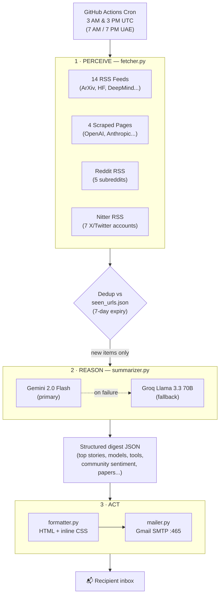

# 🤖 AI Digest Agent

An autonomous agent that monitors **19+ AI/ML sources**, reasons about what's actually important, and emails you a digest twice a day — with zero human in the loop and zero infrastructure cost.

Every morning and evening it runs its **perceive → reason → act** loop:

1. **Perceive** — pulls fresh content from RSS feeds, scraped blogs, Reddit, and Twitter/X, then filters out anything already covered in the last 7 days
2. **Reason** — hands the new items to Gemini 2.0 Flash (Groq Llama 3.3 70B as fallback), which categorises each item, judges what's actually important, assigns community sentiment, and explains *how each new model/tool/technique improves on what came before*
3. **Act** — renders the LLM's structured output as an HTML email and delivers it via Gmail

It runs on a GitHub Actions cron schedule — no server, no database, no paid APIs.

## System Design



## What It Covers

| Category | Sources |
|----------|---------|
| **Research** | ArXiv cs.AI, cs.LG, cs.CL · Papers With Code · MIT News AI |
| **Industry blogs** | HuggingFace Blog · Google DeepMind · The Batch · Sebastian Raschka |
| **Developer** | Towards Data Science · Hacker News AI · dev.to AI/ML · Hashnode AI |
| **Scraped pages** | OpenAI Blog · Anthropic News · arxiv-sanity · GitHub Trending Python |
| **Reddit** (RSS, no API key) | r/MachineLearning · r/LocalLLaMA · r/artificial · r/OpenAI · r/singularity |
| **Twitter/X** (via Nitter RSS) | @karpathy · @ylecun · @AnthropicAI · @OpenAI · @GoogleDeepMind · @huggingface · @sama |

## Tech Stack

| Tool | Purpose |
|------|---------|
| Python 3.11 | Core language |
| feedparser | RSS/Atom feed parsing (RSS, Reddit, Nitter) |
| requests + BeautifulSoup4 + lxml | Web scraping & HTML cleanup |
| google-generativeai | Gemini 2.0 Flash — the agent's reasoning engine |
| openai SDK | Groq fallback (OpenAI-compatible endpoint) |
| python-dotenv | Environment variable management |
| smtplib (stdlib) | Gmail SMTP delivery |
| GitHub Actions | Free cron scheduling + cache-based state persistence |
| JSON file | Lightweight memory for deduplication (no database) |

## Project Structure

```
ai-digest/
├── src/
│   ├── main.py            # Agent entry point — runs the perceive/reason/act loop
│   ├── fetcher.py          # PERCEIVE: orchestrates 19+ sources + 7-day dedup
│   ├── reddit_fetcher.py    # Reddit via public RSS (5 subreddits)
│   ├── nitter_fetcher.py    # Twitter/X via Nitter RSS (7 accounts, 3 mirror instances)
│   ├── summarizer.py        # REASON: Gemini 2.0 Flash + Groq fallback
│   ├── formatter.py         # ACT: HTML email builder (morning 7 sections / evening 4)
│   └── mailer.py            # ACT: Gmail SMTP sender
├── tests/
│   ├── test_formatter.py    # HTML rendering tests
│   └── test_fetcher_dedup.py # Deduplication + expiry tests
├── data/
│   └── seen_urls.json       # Agent's memory — gitignored, persisted via Actions cache
├── .github/workflows/
│   └── digest.yml           # Cron: 3 AM UTC + 3 PM UTC daily
├── .env.example              # Template for required env vars
├── requirements.txt
└── LICENSE
```

## Setup

### 1. Clone and install

```bash
git clone https://github.com/yourusername/ai-digest.git
cd ai-digest
python -m venv .venv
source .venv/bin/activate      # Windows: .venv\Scripts\activate
pip install -r requirements.txt
```

### 2. Configure environment variables

```bash
cp .env.example .env
# Edit .env with your actual values
```

#### Get Gemini API key (free)
1. Go to [aistudio.google.com/apikey](https://aistudio.google.com/apikey)
2. Click **Create API key** → copy the key
3. Paste into `.env` as `GEMINI_API_KEY`

#### Get Groq API key (free)
1. Go to [console.groq.com/keys](https://console.groq.com/keys)
2. Click **Create API key** → copy the key
3. Paste into `.env` as `GROQ_API_KEY`

#### Get Gmail App Password
1. Enable 2-Step Verification on your Google account
2. Go to [myaccount.google.com/apppasswords](https://myaccount.google.com/apppasswords)
3. App name: "AI Digest" → Create
4. Copy the 16-character password into `.env` as `GMAIL_APP_PASSWORD`

> **Reddit & Twitter/X need no API keys** — both are fetched via public RSS (old.reddit.com and Nitter mirrors).

### 3. Test locally

```bash
# Dry run — generates HTML preview, no email sent
python src/main.py --time morning --dry-run

# Open the preview printed in the console output

# Live run — sends actual email
python src/main.py --time morning
python src/main.py --time evening
```

### 4. Run the tests

```bash
python -m unittest discover tests
```

### 5. Deploy to GitHub Actions

1. Push the repository to GitHub
2. Go to your repo → **Settings** → **Secrets and variables** → **Actions**
3. Add these 5 repository secrets:

| Secret name | Value |
|-------------|-------|
| `GEMINI_API_KEY` | Your Gemini API key |
| `GROQ_API_KEY` | Your Groq API key |
| `GMAIL_ADDRESS` | Your Gmail address |
| `GMAIL_APP_PASSWORD` | Your 16-char Gmail App Password |
| `RECIPIENT_EMAIL` | Who receives the digest |

4. Go to **Actions** → **AI Digest** → **Run workflow** to test manually

The agent runs automatically at 3 AM UTC (7 AM UAE) and 3 PM UTC (7 PM UAE) every day. Its memory (`seen_urls.json`) persists between runs via `actions/cache`.

## Email Sections

**Morning (7 sections):**
🔥 Top Stories · 🧠 New Models & Embeddings · 📦 New Tools & Frameworks ·
💬 Community Pulse · 📄 Research Papers · 💡 Techniques & Approaches · 🏷️ Trending Topics

**Evening (4 sections):**
🆕 New Since Morning · 💬 Community Pulse Evening Update · 📈 Trending Today · 🔮 What to Watch Tomorrow

## Skills Demonstrated

- **Agentic system design** — autonomous perceive/reason/act loop with persistent memory and no human in the loop
- **LLM integration & prompt engineering** — structured JSON extraction from Gemini, with a Groq fallback chain and a model choice tuned to avoid extended-thinking latency
- **Multi-source data aggregation** — RSS, web scraping, and platform-specific RSS workarounds (Reddit, Nitter) unified into one pipeline
- **Resilient error handling** — every external call is isolated; one failing source never breaks the run
- **Stateful automation without a database** — JSON-based memory with time-based expiry (7-day dedup window)
- **Email deliverability** — inline-CSS HTML emails compatible with Gmail's CSS stripping
- **DevOps / CI automation** — GitHub Actions cron jobs, secrets management, and cache-based state persistence
- **Testing** — unit tests for HTML rendering and deduplication logic

---

Built by [Sahil](https://github.com/yourusername) · UAE · Backend engineer (NestJS, Python)
